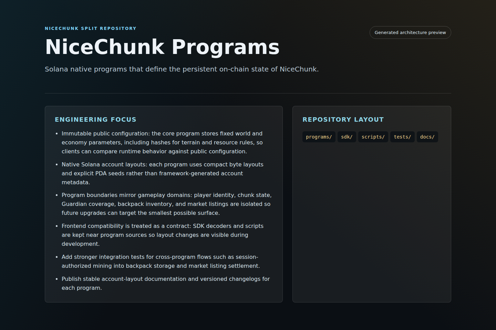

# NiceChunk Programs

Solana native programs that define the persistent on-chain state of NiceChunk.

## Project Overview

This repository contains the native Solana program layer for NiceChunk. It is intentionally separated from the browser client so protocol work can be reviewed, tested, audited, and forked without pulling in frontend assets or deployment concerns.

The current program set covers the global genesis configuration, player profile and session authority, chunk mutation and generated-block verification, Guardian registry and region staking, transferable backpack storage, and marketplace listings. These programs are small, explicit, and account-layout driven.

The repository also includes operational scripts and TypeScript helpers used to derive PDAs, initialize devnet state, inspect generated blocks, mine blocks, register Guardians, and validate global configuration accounts.

## System Principles

- Immutable public configuration: the core program stores fixed world and economy parameters, including hashes for terrain and resource rules, so clients can compare runtime behavior against public configuration.
- Native Solana account layouts: each program uses compact byte layouts and explicit PDA seeds rather than framework-generated account metadata.
- Program boundaries mirror gameplay domains: player identity, chunk state, Guardian coverage, backpack inventory, and market listings are isolated so future upgrades can target the smallest possible surface.
- Frontend compatibility is treated as a contract: SDK decoders and scripts are kept near program sources so layout changes are visible during development.

## How It Works

- Build programs with Cargo using the desired cluster feature, usually devnet during current development.
- Use the scripts directory to derive PDAs and initialize chain state from the same constants used by the SDK.
- Run focused tests for layout and instruction behavior before publishing new program IDs or account layout changes.
- When a layout changes, update the matching SDK decoder and the contract directory page in the same development cycle.

## Why This Project Matters

NiceChunk depends on verifiable game state. This repository provides the part of the system that cannot be replaced by UI code: public account ownership, deterministic PDAs, explicit state transitions, and economic settlement primitives.

Splitting the programs makes protocol review easier. A contributor can fork the on-chain layer, audit instruction handlers, or prototype a new program without dealing with browser rendering, media assets, or deployment configuration.

## Repository Layout

- `programs/`
- `sdk/`
- `scripts/`
- `tests/`
- `docs/`

## Development Workflow

1. Clone the repository and inspect the focused source tree before changing shared contracts or generated artifacts.
2. Keep changes scoped to the domain of this repository. Cross-domain changes should be coordinated through the matching split repositories.
3. Run the smallest meaningful validation for the touched surface: build checks for programs, browser checks for pages, or fixture checks for deterministic libraries.
4. Update screenshots and documentation when behavior, visible UI, public constants, or developer-facing workflows change.

## Future Development Direction

- Add stronger integration tests for cross-program flows such as session-authorized mining into backpack storage and market listing settlement.
- Publish stable account-layout documentation and versioned changelogs for each program.
- Separate generated client bindings from hand-written SDK helpers once the protocol reaches a stable release boundary.
- Prepare mainnet feature flags, deployment checklists, and reproducible build metadata before any production program deployment.

## Maintenance Notes

This repository is a focused split from the main NiceChunk working tree. Keep the public surface explicit: avoid committing private keys, wallet files, deployment-only scripts, machine-specific configuration, or generated build artifacts. Runtime user-facing copy should stay behind the i18n layer where the project has an i18n surface.
